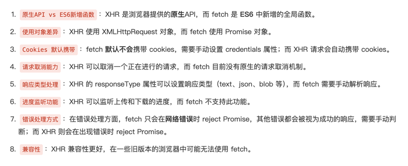

# Fetch和XHR

Fetch和XHR都是用于获取网络资源的API，相对于XHR，Fetch是一种原生的js方法，可以不引用http的类库就可以实现，而XHR是一个构造函数，需要创建一个实例对象来用于与服务交互请求数据。

## Fetch

Fetch是一个现代的API，用于替代XMLHttpRequest（XHR）。它提供了更强大和灵活的功能来处理网络请求。

### 用法

Fetch使用Promise来处理异步操作，使得代码更易读和维护。基本用法如下：

```javascript
fetch('https://api.example.com/data')
  .then(response => {
    if (!response.ok) {
      throw new Error('Network response was not ok');
    }
    return response.json();
  })
  .then(data => {
    console.log(data);
  })
  .catch(error => {
    console.error('There has been a problem with your fetch operation:', error);
  });

```

## XHR

XMLHttpRequest（XHR）是一个较旧的API，用于在浏览器中进行HTTP请求。

### 用法

XMLHttpRequest的基本用法如下：

```javascript
var xhr = new XMLHttpRequest();
xhr.open('GET', 'https://api.example.com/data', true);
xhr.onreadystatechange = function() {
  if (xhr.readyState === 4) { // 请求完成
    if (xhr.status === 200) { // 请求成功
      var data = JSON.parse(xhr.responseText);
      console.log(data);
    } else {
      console.error('Request failed with status:', xhr.status);
    }
  }
};
xhr.send();

```

### 对比

| 特性         | Fetch                          | XHR                             |
|--------------|--------------------------------|----------------------------------|
| 语法         | 更简洁，基于Promise            | 较复杂，基于回调函数              |
| 错误处理     | 使用`.catch()`处理错误        | 需要检查`readyState`和`status`    |
| 响应类型     | 支持多种响应类型（如JSON、Blob）| 主要处理文本和XML响应            |
| CORS支持     | 默认支持CORS                   | 需要手动设置CORS头部              |
| 取消请求     | 使用`AbortController`         | 使用`abort()`方法                 |
| 进度事件     | 不支持进度事件                | 支持`onprogress`事件              |
| 同步请求     | 不支持同步请求                | 支持同步请求（不推荐）            |
| 浏览器支持   | 新浏览器支持较好              | 兼容性较好，旧浏览器也支持         |




### 总结

Fetch是一个现代的API，提供了更简洁和灵活的方式来处理网络请求。它使用Promise来处理异步操作，使得代码更易读。相比之下，XMLHttpRequest（XHR）是一个较旧的API，语法较为复杂，错误处理也不如Fetch方便。
因此，建议在新项目中使用Fetch API，而在需要兼容旧浏览器时，可以使用XHR作为备选方案。
