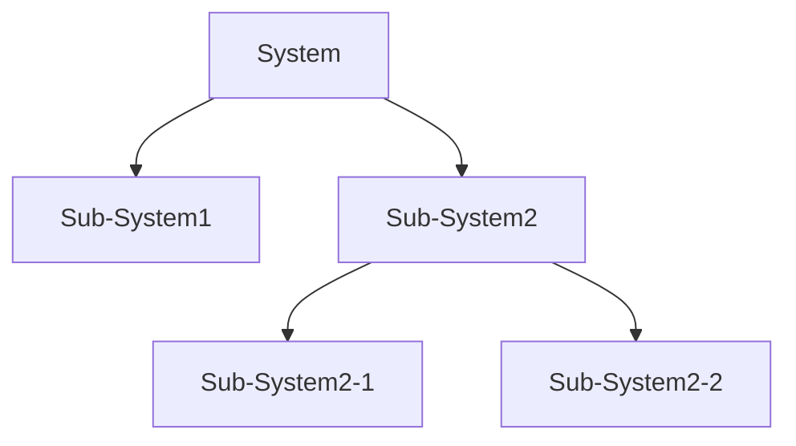

# 算法基本概念

🙋什么是计算思维？

2006 年，美国卡内基梅隆大学的 Jeannette M. Wing 教授首次提出了计算思维的概念。

谷歌公司为教育者开发了一套计算思维的课程：

1. 分解
2. 模式识别
3. 抽象
4. 算法


**分解**

decomposition

将一个复杂的问题拆解成一个一个简单的问题，然后逐一击破。

比如在设计一个复杂的系统的时候，也会采用分解的思想：




**模式识别**

一些问题具备相同的属性或者说相似之处，这些相似之处被称之为 **模式**。

模式识别指的就是在一组数据中找出特征或规则，用于对数据进行分类，以作为决策判断的依据。


**抽象**

- 现实生活中：“抽象”，代表模糊不清的意思
- 计算机科学：“抽象”，提取问题的关键部分，忽略无关紧要的细节部分。

```js
class Person{
  // 提取关键的信息，也就是这里程序会用到的信息
}
```

前端开发中组件库也是一种抽象，headless 无头组件库，更是一种抽象，专注于组件的逻辑功能。


**算法**

本质就是解决问题的方法和步骤。

将大象装入冰箱需要几个步骤？

1. 打开冰箱门
2. 将大象塞进去
3. 关上冰箱门

一瓶可乐和一瓶雪碧，如何做交换？

1. 拿一个空瓶（A），将可乐瓶里面的可乐倒进去
2. 将雪碧瓶里面的雪碧倒入空的可乐瓶
3. 将瓶A里面的可乐倒入空的雪碧瓶


**算法的条件（要求）**

一个算法必须要符合以下 5 个条件：

1. 输入：一个算法有 0 个或者多个输入，并且这些输入要有明确的描述或者含义
2. 输出：至少会有一个输出结果
3. 明确性：算法设计中的每一个步骤必须是简洁明确的
4. 有限性：你设计的算法在有限的步骤后会结束
5. 有效性：算法的步骤清楚而且是可行，所谓可行，指的是只要时间允许，我甚至可以使用笔和纸来求出答案


**算法的描述**

如何来做一个算法的表达，将我的算法设计传达给别人。

1. 自然语言描述：所谓自然语言，就是指中文、英文这种语言来描述算法。缺点：描述算法的时候比较冗余，而且通过自然语言描述算法的时候，对方容易产生理解上的偏差。
2. 流程图
3. 伪代码


**流程图**

1. 椭圆：表示算法的开始和结束
2. 平行四边形：表示算法的输入和输出
3. 矩形：表示处理的步骤
4. 菱形：表示条件或者说分支
5. 流程线：连接上述的图形


**伪代码**

伪代码也是有语法的规定的。

1. 输入输出一个值

```pseudocode
INPUT StudentName
OUTPUT "You have made an error"
OUTPUT StudentName
OUTPUT "Student name is ", StudentName
```

2. 变量初始化

```pseudocode
Counter ← 1
Counter ← Counter + 1
MyChar ← "A"
LetterValue ← ASC(MyChar)
StudentMark ← 40
Percentage ← (StudentMark / 80) * 100
Oldstring ← "Your mark is"
NewString ← OldString & " ninety-seven"
```

3. 分支

```pseudocode
IF MyValue > YourValue
 THEN
 	OUTPUT "I win"
 ELSE
 	OUTPUT "You win"
ENDIF
```

4. 循环


```pseudocode
Total ← 0
FOR Counter ← 1 TO 10
 OUTPUT "Enter a number "
 INPUT Number
 Total ← Total + Number
NEXT Counter
OUTPUT "The total is ", Total
```
