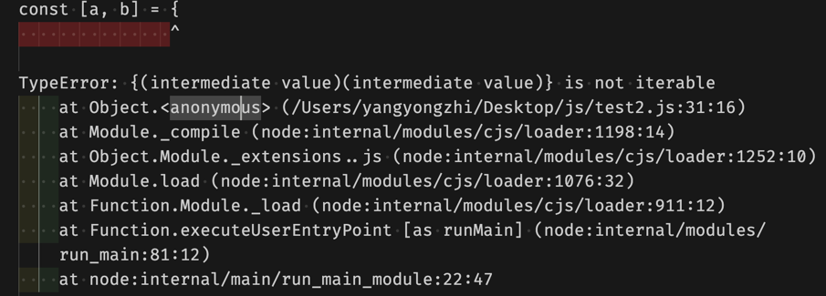

## 不修改原代码的情况下，使下面的代码成立

```js
const temp = {
  a: 1,
  b: 2,
}
const [a, b] = temp
console.log(a, b); // 1 2
```

## 分析

首先执行一次代码，此时代码的报错是这样的

`TypeError: {(intermediate value)(intermediate value)} is not iterable`, 此错误表明在尝试迭代一个非可迭代对象。说明右侧的 `temp` 不是一个可迭代对象。

换而言之，只要将`temp` 变成一个可迭代对象就可以了。

所以，怎么将`temp` 变成一个可迭代对象呢？

可迭代对象的定义是实现了一个由著名符号`Symbol.iterator` 的方法的对象。并且这个方法返回一个迭代器对象。迭代器对象必须实现`next()`方法，并且返回一个包含`value`和`done`属性的对象。

什么又是迭代器对象呢？迭代器对象是一个可以被迭代的对象，它有一个`next()`方法，每次调用`next()`方法都会返回一个包含`value`和`done`属性的对象。

所以，当代码为如下代码时，对象就可以被迭代了。

```js
const [a, b] = {
  a: 1,
  b: 2,
  [Symbol.iterator]: function () {
    let index = 0;
    const values = Object.values(this);
    return {
      next: () => {
        if (index < values.length) {
          return { value: values[index++], done: false };
        } else {
          return { done: true };
        }
      }
    };
  }
}   ;
console.log(a, b); // 1 2
```
但是，要求我们不修改原代码的情况下使代码成立，所以可以考虑将迭代器的定义放在`temp`的原型上。
```js
Object.defineProperty(Object.prototype, Symbol.iterator, {
  value: function () {
    let index = 0;
    const values = Object.values(this);
    return {
      next: () => {
        if (index < values.length) {
          return { value: values[index++], done: false };
        } else {
          return { done: true };
        }
      }
    };
  },
  writable: true,
  configurable: true,
  enumerable: false
});

const [a, b] = {
  a: 1,
  b: 2,
};
console.log(a, b); // 1 2
```
也可以使用生成器实现迭代器
```js
Object.defineProperty(Object.prototype, Symbol.iterator, {
  value: function* () {
    for (const value of Object.values(this)) {
      yield value;
    }
  },
  writable: true,
  configurable: true,
  enumerable: false
});

const [a, b] = {
  a: 1,
  b: 2,
};
console.log(a, b); // 1 2
```


